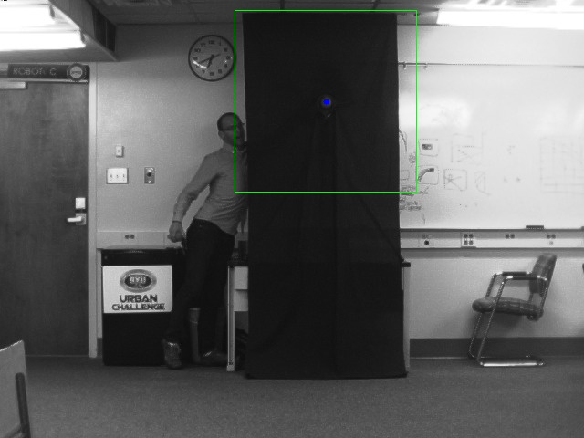
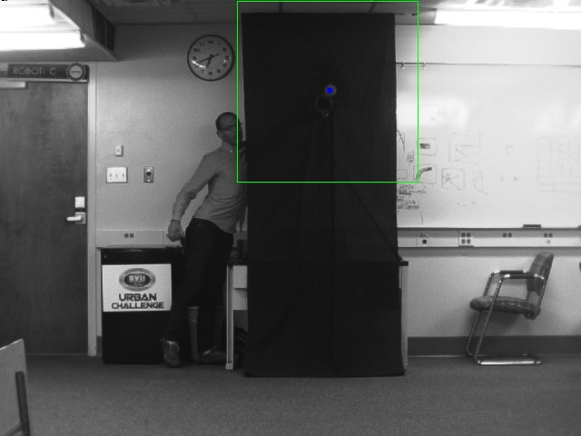
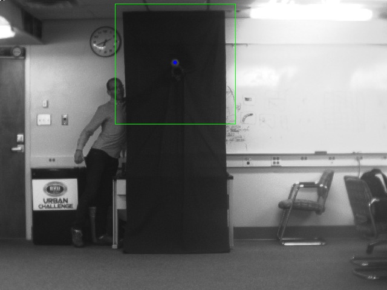
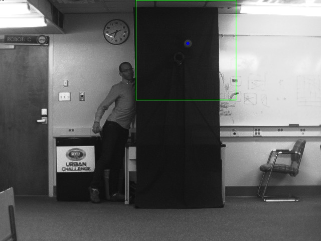
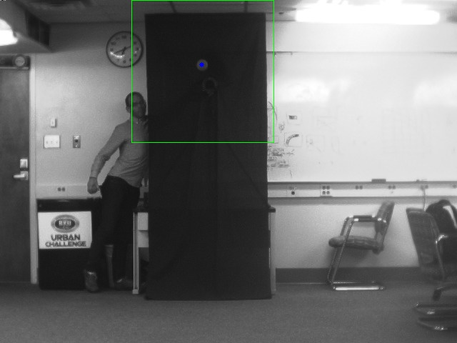
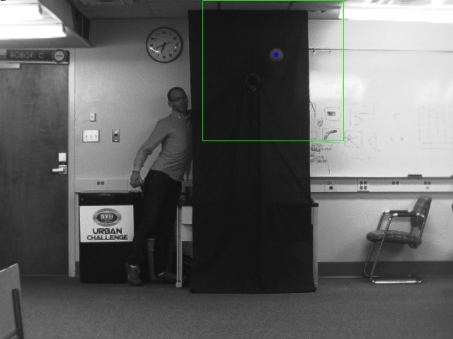
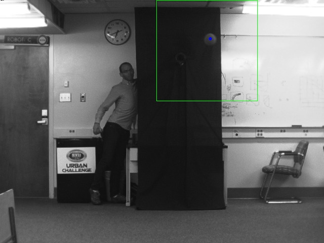
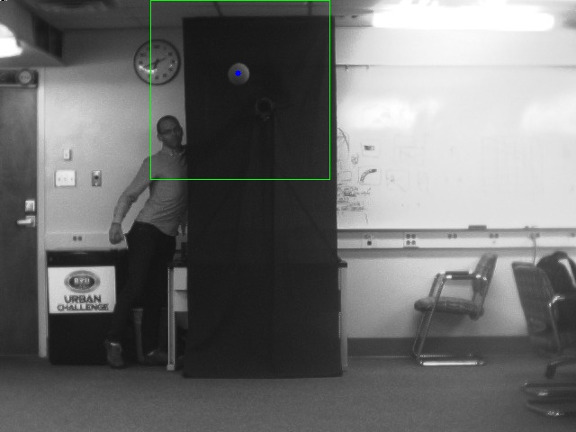
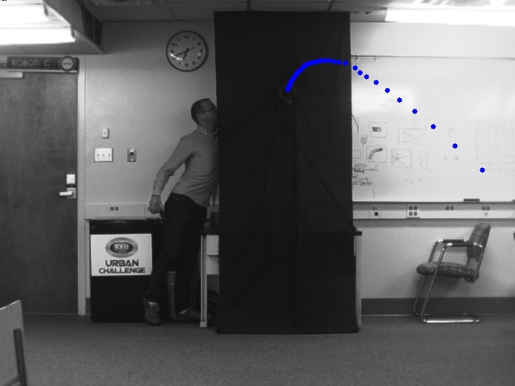
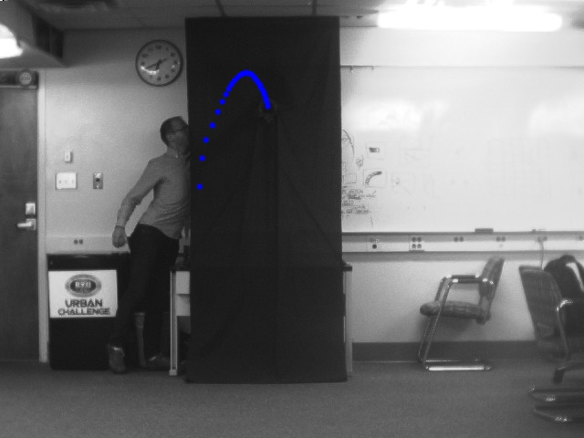

# 3D Reconstruction and Trajectory Estimation
#### *EcEn 631 - Assignment 4 - Luke Newmeyer*

## Task 1 - 3D Measurement

## Task 2 - Baseball Tracking

The following are the images of the tracked baseball using my code. The images are first left and then right for images 1, 5, 10, 15, and 20.

These final images are composite images displaying the ball path on the image.

## Task 3 - Baseball Trajectory Estimation
