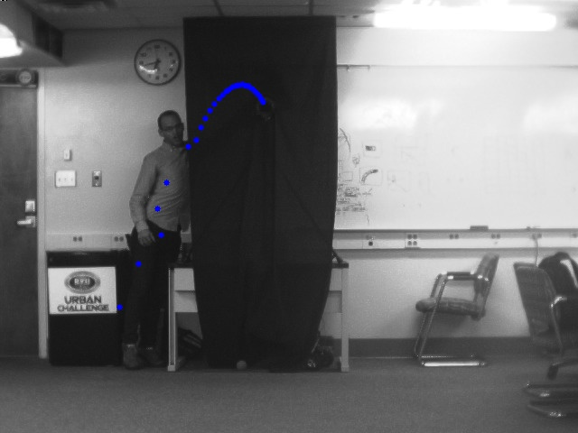

# 3D Reconstruction and Trajectory Estimation
#### *EcEn 631 - Assignment 4 - Luke Newmeyer*

## Task 1 - 3D Measurement

Below are the the four outermost corners coordinates and placement on the left and right images. The values are ordered x, y, and z.

	[0.419387, -8.72048, 218.46 ]
	[  34.258, -17.5335, 217.463]
	[ 6.36191,  13.5979, 221.321]
	[ 40.1549,  4.79626, 220.168]

I believe this data to be correct because the left camera sits just left of the pitching machine. This lines up well with the x coordinates. Also, the distance (z coordinate) is similar across all of the images which is expected since they are all on the chessboard.

## Task 2 - Baseball Tracking

The following are the images of the tracked baseball using my code. The images are first left and then right for images 1, 5, 10, 15, and 20.

These final images are composite images displaying the ball path on the image.

## Task 3 - Baseball Trajectory Estimation

The points obtained from the perspective transform are shown below. The values are in order x, y, and z.

	[14.2554, -27.0417, 408.737]
	[13.9705, -27.1068, 397.578]
	[13.617, -27.0489, 386.01]
	[13.2192, -26.9779, 373.542]
	[12.9437, -26.762, 362.565]
	[12.639, -26.5592, 351.931]
	[12.2792, -26.2489, 340.085]
	[11.9925, -25.9843, 330.005]
	[11.6495, -25.5479, 318.04]
	[11.3661, -25.1002, 307.576]
	[11.093, -24.711, 297.363]
	[10.8239, -24.1101, 286.032]
	[10.5372, -23.4801, 275.1]
	[10.2846, -22.8109, 264.379]
	[10.0348, -22.0578, 253.559]
	[9.8039, -21.2955, 242.826]
	[9.5776, -20.494, 232.429]
	[9.3534, -19.5811, 221.929]
	[9.1238, -18.644, 211.281]
	[8.8843, -17.5919, 200.955]
	[8.687, -16.7063, 191.259]
	[8.4944, -15.6874, 180.725]
	[8.3378, -13.878, 167.453]
	[8.1393, -12.7147, 159.725]
	[7.9496, -11.6262, 151.844]
	[7.8143, -10.2729, 142.215]
	[7.7247, -8.84575, 132.534]
	[7.5633, -7.33512, 122.657]
	[7.3978, -5.7759, 112.448]
	[7.2093, -4.09655, 102.098]
	[7.2837, -2.41127, 93.19]
	[17.4271, -0.669638, 84.4581]

I recognize that the x dimension appears to be off. I am working to resolve this and will let you know what I find out. This is a consistent issue I have experienced and need to continue debugging. The x-coordinate is already adjusted to the midpoint between the cameras and should be 0 but seems to have an error.

### Predict Trajectory in X

The trajectory prediction is done using least squares. Specifically, I use a quadtratic data fit. The problem is setup as follows. Our quadratic equation is

$az^{2} + bz + c$.

We create matricies $A$, $x$, and $b$ to match this equation.

$A =
\begin{bmatrix}
    z_{1}^{2} & z_{1} & 1 \\
    z_{2}^{2} & z_{2} & 1 \\
    \vdots    & \vdots & \vdots \\
    z_{N}^{2} & z_{N} & 1
\end{bmatrix}
,
x =
\begin{bmatrix}
    a \\
    b \\
    c
\end{bmatrix}
,
b =
\begin{bmatrix}
    x_{1} \\
    x_{2} \\
    \vdots \\
    x_{N}
\end{bmatrix}$

This forms the equation

$Ax = b$

This is an over-detirmined problem and thus the least-squares solution can be applied

$x = (A^{T}A)^{-1}A^{T}x$

The result of this estimation predicts the ball will fall at 6.40". The figure below shows these results.

### Trajectory Prediction in y

I approach this, once again, as a quadratic least squares problem. This is especially fitting since the acceloration, velocity, position model is qudratic. The matricies are setup as

$A =
\begin{bmatrix}
    z_{1}^{2} & z_{1} & 1 \\
    z_{2}^{2} & z_{2} & 1 \\
    \vdots    & \vdots & \vdots \\
    z_{N}^{2} & z_{N} & 1
\end{bmatrix}
,
x =
\begin{bmatrix}
    a \\
    b \\
    c
\end{bmatrix}
,
b =
\begin{bmatrix}
    y_{1} \\
    y_{2} \\
    \vdots \\
    y_{N}
\end{bmatrix}$

The result of this estimation predicts the ball will fall at 15.66". Note: this is relative to the camera y-position not the catcher. I couldn't find documented the catcher 0,0 position relative to the cameras but will measure this Monday. The figure below shows these results.

