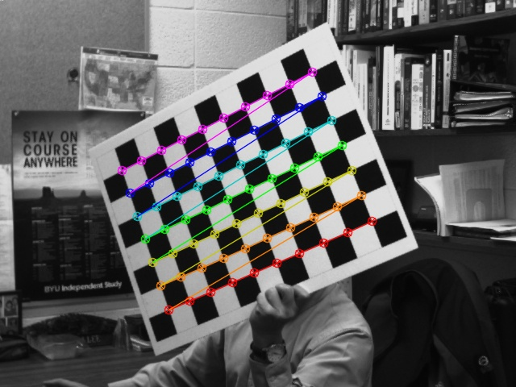
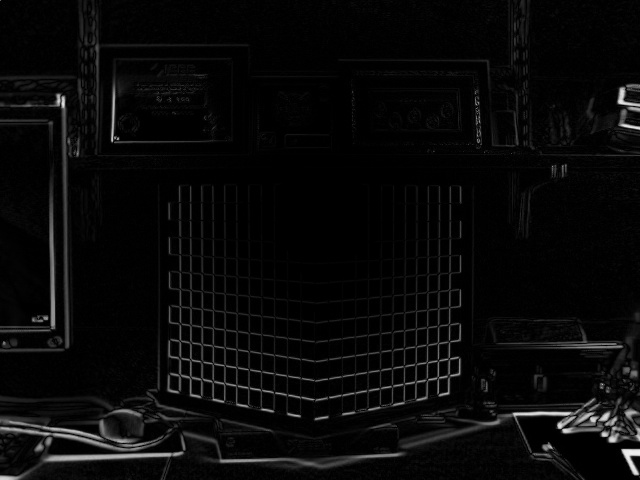
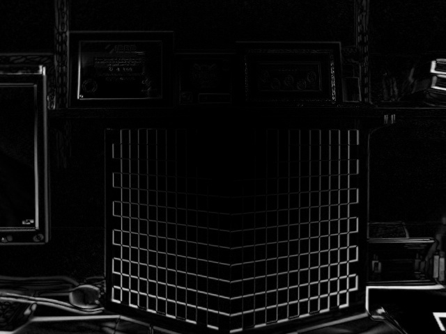
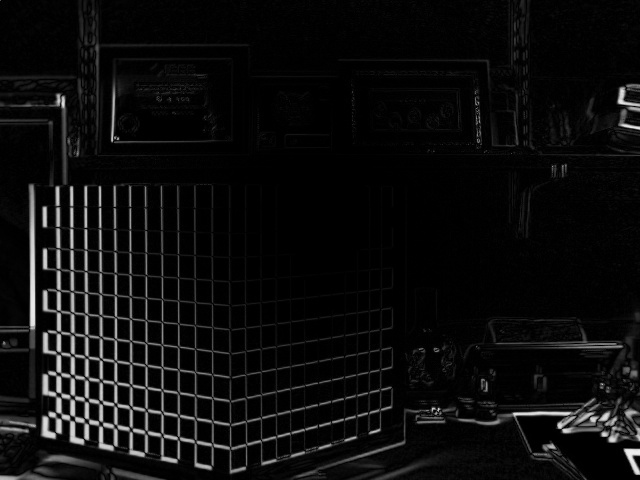
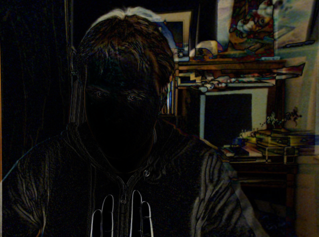

# Camera Calibration & Distortion Correction
#### *EcEn 631 - Assignment 2 - Luke Newmeyer*

 

## Task 1 - Corner Detection

The following is the result given from my code written for corner detection.

### Corner Detection Output

## Task 2 - Intrinsic Parameters

The following are the intrinsic and distortion parameters computed from the images provided.

	intrinsic_params = 
		[1145.223455665104, 0, 328.945216696177;
		 0, 1143.600007277263, 222.1597641571362;
		 0, 0, 1]
	distortion_params = 
		[-0.2575507934862325;
		 0.04884197280891184;
		 -0.001409751152446753;
		 -0.001543707631160005;
		 0.9076529637760357]

## Task 3 - Distortion Correction

The following images are distortion corrected from the intrinsic parameters computed in Task 2.

### Distortion Correction Far

### Distortion Correction Close

### Distortion Correction Turn

## Task 4 - Object Pose Estimation

The following are the rotation and translation matricies for the object data provided.

	rotation = 
		[0.7354706625150564, -0.6774298093547906, 0.01310564676756049;
		 -0.003190169014756383, -0.02280449923942213, -0.9997348536667592;
		 0.6775490590365552, 0.7352338459374481, -0.01893315575141785]
	translation = 
		[-0.02466089907017876;
		 10.48750338023632;
		 46.67923546700356]

## Task 5 - Intrinsic Parameters (Camera)

The following are the intrinsic and distortion parameters using my personal webcam.

	intrinsic_params = 
		[957.6129263627653, 0, 409.749409549764;
		 0, 953.5666607530868, 282.6446950085418;
		 0, 0, 1]
	distortion_params = 
		[-0.1271090608365228;
		 0.2924936363105562;
		 0.0051567508076029;
		 -0.05116578986005205;
		 -1.617042692213017]

## Task 6 - Distortion Correction (Camera)

The following is an image captured, corrected for distortion, and diffed against the original.

### Distortion Correction Output

