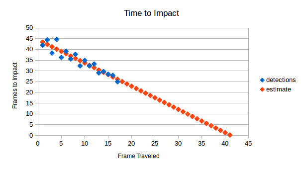
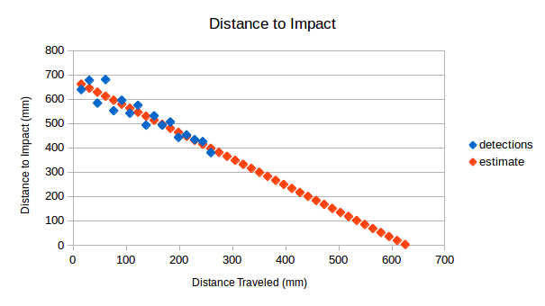
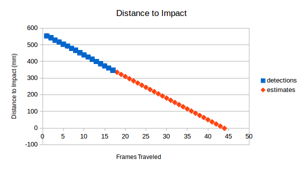

# Time to Impact
#### *EcEn 631 - Assignment 7 - Luke Newmeyer*

## Task 1 - Unknown Object Velocity and Object Size

My algorithm estimates time to impact by finding corners on the image and tracking across frames using the Lucas-Kanade method (calcOpticalFlowPyrLK() in OpenCV). The estimate is made by averaging the change in distance from the center of the image of each point. The following formulas are used.

$a = x' / x = y' / y$

$\tau = a / (a - 1)$

Here, $\tau$ is in units of frames till impact. The following graph shows the averaged detections along with a linear fit of the data. A linear fit is logical for this data set since the camera is expected to be moving at a constant velocity.

From the graph we can see that impact is expected at about frame 41.

## Task 2 - Known Object Velocity

Since we know that the camera is traveling 15.25 mm every frame, the distance to impact is simply the number of frames multiplied by this factor.

$d = 15.25 \times \tau$

To be more precise in our estimate we can use our linear fit of the frames to impact. This is computed by

$d = -b / m$

where $b$ and $m$ are constants in the linear equation

$y = mx + b$.

Solving for this we find an expected impact at 627.7498 mm from the initial frame. The following graph describes shows the expected distance to impact of the fitted line to the distance data.

## Task 3 - Known Object Size and Camera Parameters

When the focal length of the camera and object size are known distance to the object can be found by

$d = f * x / X$.

The results from this applied in code are shown in the graph below.

Using linear reguression with this data the expected distance to impact is 668.4050 mm (43.8 frames). This is quite close to the values obtained from Tasks 1 and 2.
