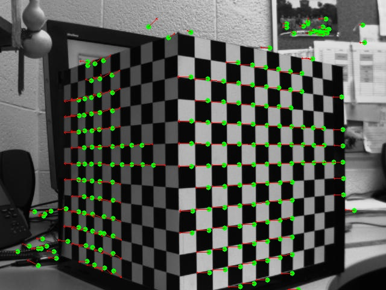
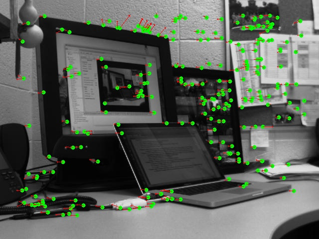
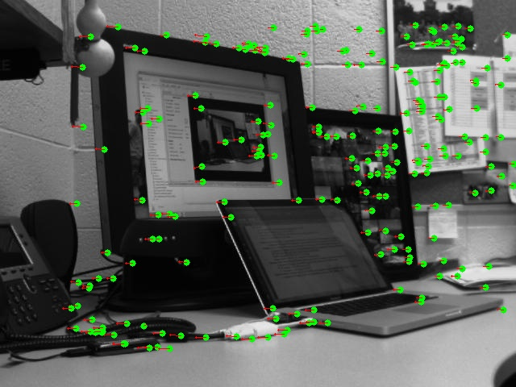
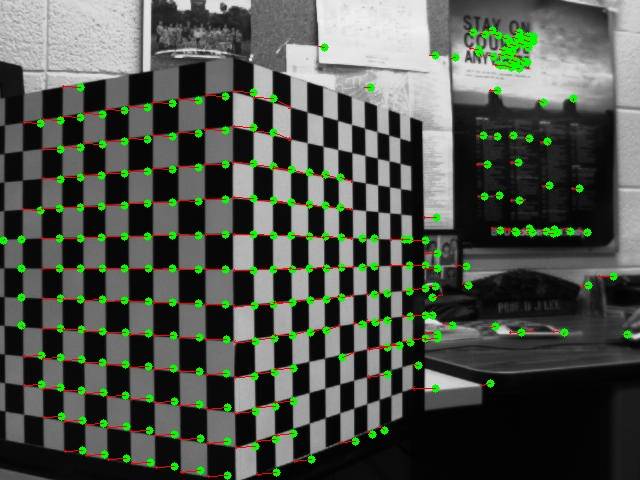
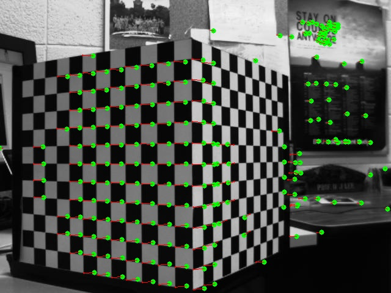
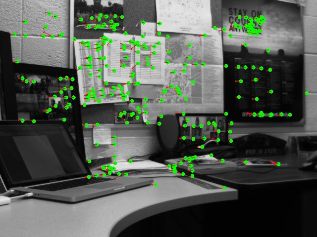
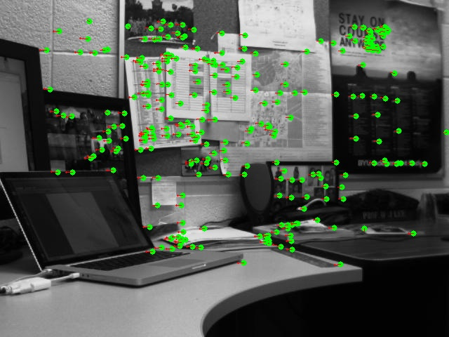

# Motion Field
#### *EcEn 631 - Assignment 5 - Luke Newmeyer*

## Task 1 - Optical Flow

The following are the images from using the Lucas-Kanade method for optical follow. From these images you can see that images with fewer skips in frames result in greater resolution but less clarity in the direction of the gradient. There is a trade-off between these two.

## Task 2 - Feature Matching

The results from my feature matching algorithm seem to be less accurate than the Lucas-Kanade algorithm. Perhaps some more tuning of the parameters would improve this. I played with quite a few of the parameters but didn't have much success.

## Task 3 - Multi-Frame Feature Tracking

The Multi-frame feature tracking works quite well. Some minor challenges occur when ambiguity exists in the image. In general, however, a clear direction of movement can be seen.

### Parallel Cube

### Parallel Real

### Turned Cube

### Parallel Real

