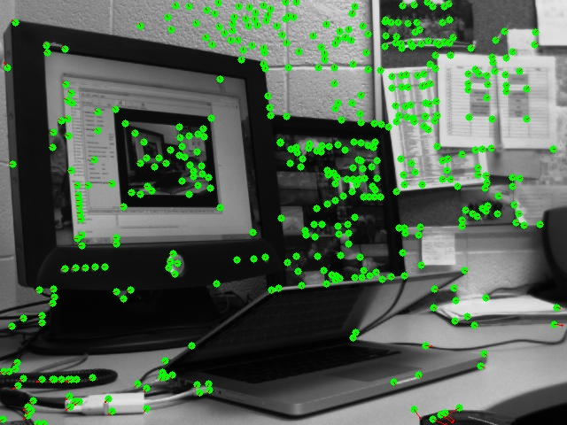
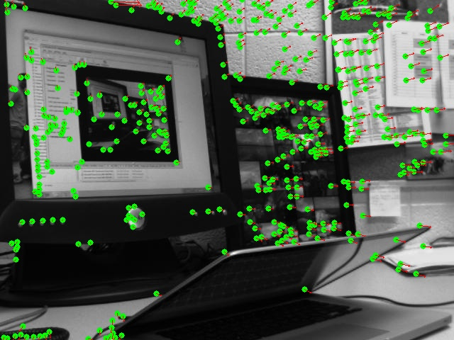
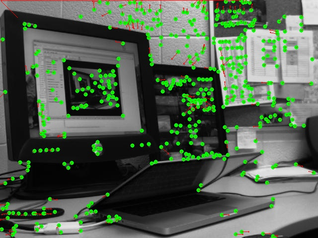
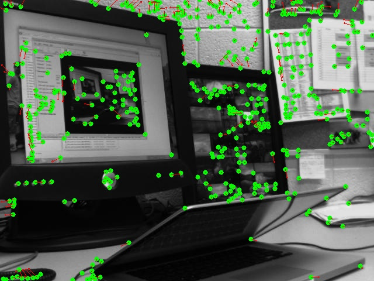
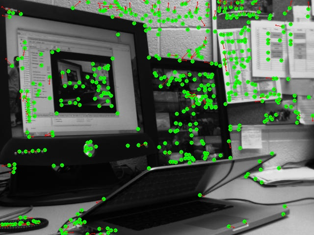
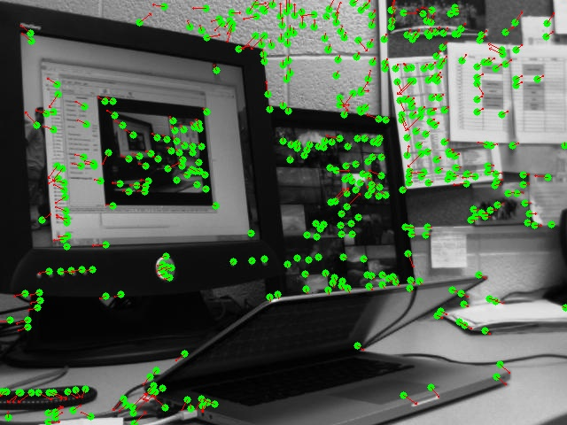
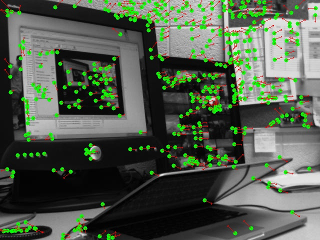

# Motion Field
#### *EcEn 631 - Assignment 5 - Luke Newmeyer*

## Task 1 - Optical Flow

The following are the images from using the Lucas-Kanade method for optical follow. From these images you can see that images with fewer skips in frames result in greater resolution but less clarity in the direction of the gradient. There is a trade-off between these two.

### Single Frame Flow

### Double Frame Flow

### Triple Frame Flow

## Task 2 - Feature Matching

### Single Frame Flow

### Double Frame Flow

### Triple Frame Flow

## Task 3 - Multi-Frame Feature Tracking

