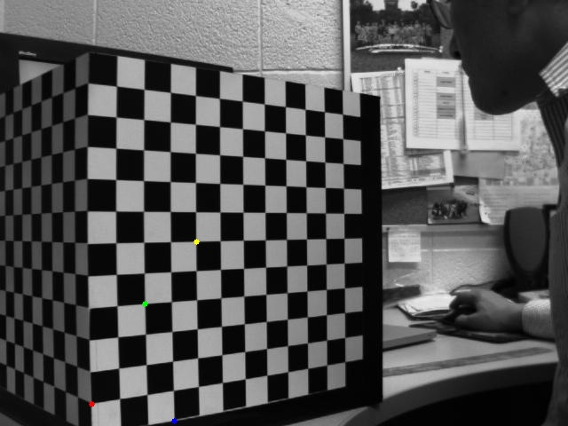
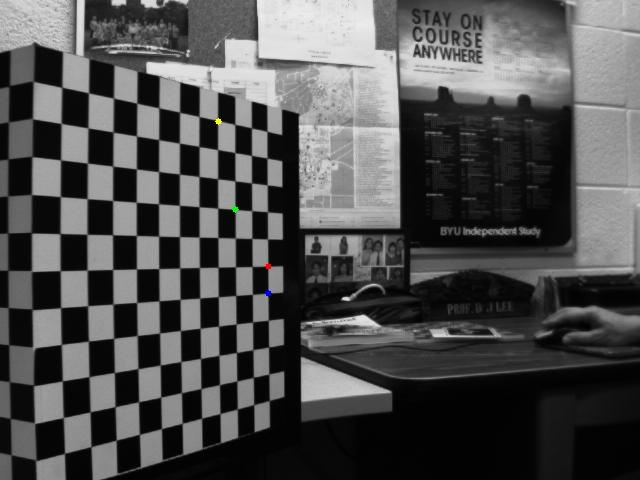

# Structure from Motion
#### *EcEn 631 - Assignment 6 - Luke Newmeyer*

## Task 1 - Unkown Intrinsic and Extrinsic Parameters

Below are the undistorted images and results from point matching of the given image sequences.

### Parallel Cube

	M =
		[1145, 0, 320;
		 0, 1145, 240;
		 0, 0, 1]
	H1 =
		[1064774068356.214, 189676501643.5382, 792072529304937.2;
		 -0.04921620061393324, 2025271489153.147, -17.29032102335444;
		 -0.0004225572424859666, 0.0001220703125001998, 2025271489153.14]
	H2 =
		[1, -2.509352270312684e-14, 6.02540239924565e-12;
		 2.509352270312684e-14, 1, -8.043343768804334e-12;
		 0, 0, 1]
	R1 =
		[1064774068356.349, 189676501643.4992, 463087960737.4708;
		 0.05219753758269875, 2025271489153.118, -0.005240174672489083;
		 -0.4838280426464318, 0.1397705078127288, 2025271489153.034]
	R2 =
		[1, -2.509352270312684e-14, 0;
		 2.509352270312684e-14, 1, 0;
		 0, 0, 1]

### Parallel Real

	M =
		[1145, 0, 320;
		 0, 1145, 240;
		 0, 0, 1]
	H1 =
		[1819782055457.797, 75288325610.24756, 461482222343082.8;
		 -0.07389207751521204, 2302341371826.048, 2.075758582167994;
		 -0.0002697855568486096, 1.09831071832023e-16, 2302341371826.044]
	H2 =
		[1, 4.17049760249912e-15, -1.023181539494544e-12;
		 -4.17049760249912e-15, 1, 1.335820343228988e-12;
		 0, 0, 1]
	R1 =
		[1819782055457.883, 75288325610.24756, 283958462228.5859;
		 -0.00914354387154573, 2302341371826.048, 0.0001091703056768559;
		 -0.308904462591658, 1.257565772476664e-13, 2302341371825.958]
	R2 =
		[1, 4.17049760249912e-15, 0;
		 -4.17049760249912e-15, 1, 0;
		 0, 0, 1]

### Turned Cube

	M =
	[1145, 0, 320;
	 0, 1145, 240;
	 0, 0, 1]
	H1 =
	[6164769268.843471, 1132462705.024328, 5976893936372.801;
	 0.03104961462619977, 15914123655.58019, 0.591796875;
	 0.0001257430858871348, 4.768371590041471e-06, 15914123655.5825]
	H2 =
	[1, -8.042259552064386e-14, 1.932676241267473e-11;
	 8.042259552064386e-14, 1, -2.569322532508522e-11;
	 0, 0, 1]
	R1 =
	[6164769268.803232, 1132462705.022802, 2732656403.326557;
	 0.0008712740132874063, 15914123655.57905, 3.7100846069869e-05;
	 0.1439758333407694, 0.005459785470597485, 15914123655.62388]
	R2 =
	[1, -8.042259552064386e-14, 0;
	 8.042259552064386e-14, 1, 2.482245365100787e-17;
	 0, 0, 1]
### Turned Real

	M =
		[1145, 0, 320;
		 0, 1145, 240;
		 0, 0, 1]
	H1 =
		[1519282464728.659, 97764818130.47867, 226753639460712.9;
		 -0.1372416946180088, 1698449337927.822, -3.94452077714305;
		 -0.0006098703308511508, 0.0002441406250003108, 1698449337927.818]
	H2 =
		[1, -5.433977066911953e-15, 1.307398633798584e-12;
		 5.433977066911953e-15, 1, -1.733724275254644e-12;
		 0, 0, 1]
	R1 =
		[1519282464728.854, 97764818130.40054, 168457464094.6206;
		 0.00912718478626743, 1698449337927.763, -0.01239082969432314;
		 -0.6983015288245676, 0.2795410156253559, 1698449337927.681]
	R2 =
		[1, -5.433977066911953e-15, 0;
		 5.433977066911953e-15, 1, 0;
		 0, 0, 1]

## Task 2 - Known Intrinsic and Unknown Extrinsic Parameters

The following are the rotation, translation, essential, and fundamental matricies computed for each of the picture sequences. I believe these results to be correct because the follow the motion of the camera. The rotation matricies are similar to the identity matrix meaning that the camera wasn't turning in the image sequences. Additionally, the translation shows that most of the movement is in the X direction with minimal in the Y, and Z directions (the turned images have some movement in Z).

### Parallel Cube

	F =
		[3.729660214284612e-06, 0.0004268219652772261, -0.0516160755734793;
		 -0.0004225572424861744, -4.713907342682297e-06, 2025271489153.141;
		 0.04921620061398722, -2025271489153.148, 1]
	E =
		[2.539054237712845, 290.2793503317862, 47.505624141418;
		 -287.3789350255412, -3.202706151405766, 1669364889468222;
		 -46.55453728657822, -1669364889468228, -1]
	R =
		[1, 5.697297582087485e-16, -1.737436389457103e-15;
		 -5.697297582089788e-16, 1, 1.918517737860066e-15;
		 1.737436389457128e-15, -5.990302098174786e-16, 1]
	T =
		[1;
		 -2.845730399694124e-14;
		 1.738861001349167e-13]

### Parallel Real

	F =
		[1.525157159844809e-07, 0.0002734386389977007, -0.07522718253078625;
		 -0.0002697855568487261, -7.181602980292445e-07, 2302341371826.044;
		 0.07389207751524018, -2302341371826.048, 1]
	E =
		[0.1038286741256087, 185.9641652516788, -4.963902524453154;
		 -183.4797234956782, -0.4879299139734229, 1897744509949004;
		 4.708147831397352, -1897744509949006, -0.125]
	R =
		[0.9999999999999999, -1.347677159465018e-16, -1.309155022172675e-15;
		 1.347677159464828e-16, 1, 2.571104336834881e-16;
		 1.309155022172649e-15, -6.58676651913238e-17, 1]
	T =
		[0.9999999999999999;
		 2.615685356184519e-15;
		 9.799220299505742e-14]

### Turned Cube

	F =
		[1.252319624287506e-07, 0.0001318143602090905, -0.03291530158000219;
		 -0.0001257430858788524, -4.246866836141358e-06, -15914123655.5825;
		 0.03104961462421512, 15914123655.5802, 1]
	E =
		[0.0852546147994892, 89.64624587922172, 0.3843526021958859;
		 -85.51720447170445, -2.885391152506531, -13117490380742.5;
		 -0.5881678042729154, 13117490380740.49, 0.05029296875]
	R =
		[1, 1.553766735636865e-14, 3.147737324505753e-13;
		 -1.553766735633529e-14, 1, -1.080247002962187e-13;
		 -3.147737324505778e-13, 1.080247002957213e-13, 1]
	T =
		[1;
		 2.930077255938707e-14;
		 -6.834100371123054e-12]

### Turned Real

	F =
		[-1.440472759889162e-07, 0.0006122952569218691, -0.1377215269096388;
		 -0.000609870330851503, -2.615268992017444e-06, 1698449337927.818;
		 0.1372416946180963, -1698449337927.822, 1]
	E =
		[-0.09806358368246233, 416.4187503215122, 14.10704043682095;
		 -414.7695709878026, -1.77685675161128, 1399976105160443;
		 -14.07572596428212, -1399976105160446, -0.0625]
	R =
		[0.9999999999999999, 2.236786215384507e-17, -1.178005344255264e-15;
		 -2.236786215420479e-17, 1, 1.269205056473182e-15;
		 1.178005344255971e-15, -4.464361910866601e-17, 1]
	T =
		[0.9999999999999999;
		 -1.007662944018908e-14;
		 2.974470412648857e-13]

## Task 3 - Known Intrinsic and Extrinsic Parameters

### Parallel Cube

### Parallel Real

### Turned Cube

### Turned Real

