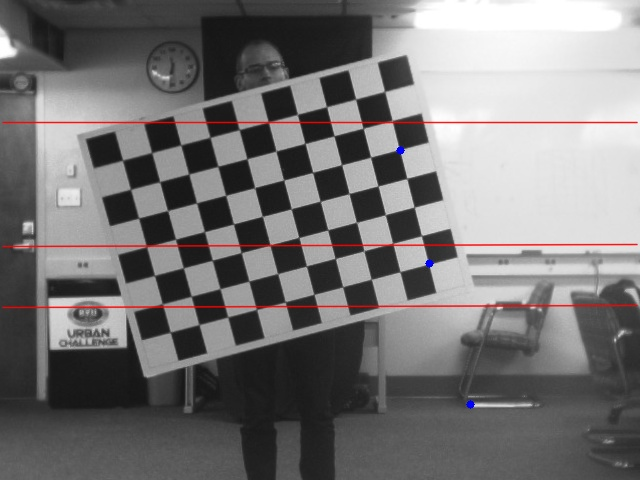
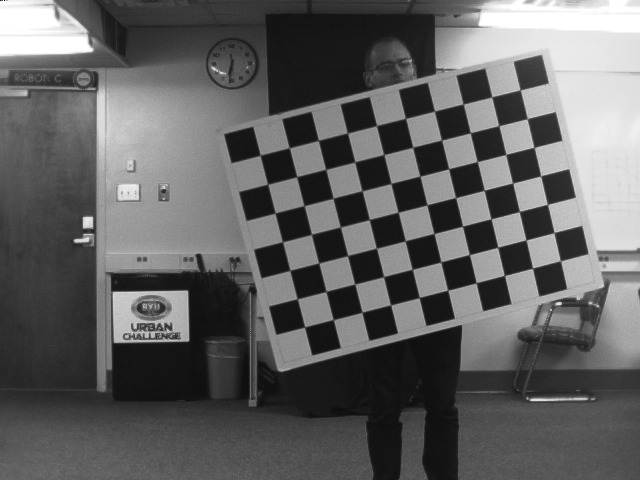
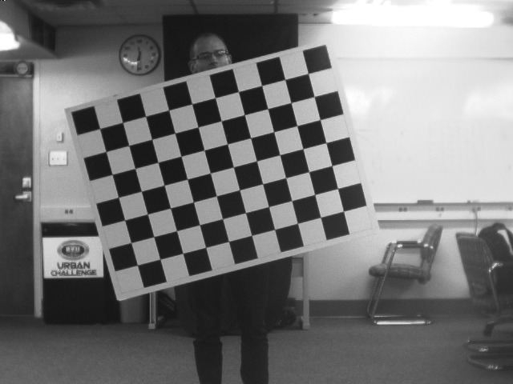
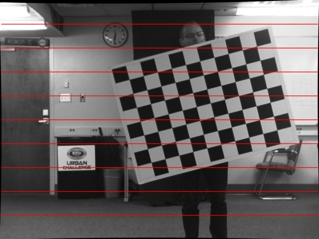

# Stereo Calibration & Rectification
*EcEn 631 - Assignment 3 - Luke Newmeyer*

## Task 1 - Camera Calibration

The following parameters result from the calibration sequence.

	left_intrinsic =
		[1690.816493140574, 0, 334.2100930518936;
		 0, 1694.136704168955, 236.2425753638842;
		 0, 0, 1]
	left_distortion =
		[-0.5191186765058345;
		 1.538827670363897;
		 0.002422391389104507;
		 -0.001102616739162721;
		 -33.84065471582704]
	right_intrinsic =
		[1686.489467639931, 0, 335.7403477559992;
		 0, 1690.138405505449, 214.4290609858097;
		 0, 0, 1]
	right_distortion =
		[-0.5051369316322002;
		 1.510079171649894;
		 0.003553366568451884;
		 0.001672805989432977;
		 -22.97201594178351]

## Task 2 - Stereo Calibration

The stereo calibration parameters computed for this camera are as follows.

	rotation =
		[0.9999152095720598, 0.006481027324160356, 0.01129468686095925;
		 -0.006655606693022458, 0.9998578969319266, 0.0154883453736245;
		 -0.01119270146173091, -0.01556220510365956, 0.9998162537218027]
	translation =
		[-20.34597495695317;
		 0.02813668716162538;
		 -0.7068003812449918]
	essential =
		[-0.005019110887567181, 0.7062620738457547, 0.03907868556501053;
		 -0.934466874979228, -0.3212090278976019, 20.33425337079917;
		 0.1072805056596847, -20.34326608612715, -0.3154432821672009]
	fundamental =
		[1.811838880307009e-08, -2.544524831406549e-06, 0.0003565473306358181;
		 3.366030588070112e-06, 1.154755166395077e-06, -0.1252428709078041;
		 -0.001380984238462987, 0.1242142714653703, 1]

## Task 3 - Epipolar Lines

The following are the epipolar lines produced by the clibration.

## Task 4 - Rectification

The following are the results of image rectification for the stereo system. The first images are the original images followed by the rectified and absolute difference images.

