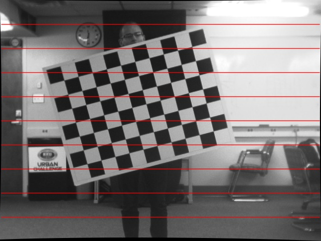
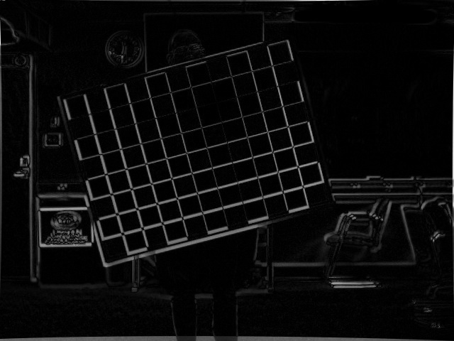

# Stereo Calibration & Rectification
*EcEn 631 - Assignment 3 - Luke Newmeyer*

 

## Task 1 - Camera Calibration

The following parameters result from the calibration sequence.

	left_intrinsic =
		[1714.270724585294, 0, 321.2806862604946;
		 0, 1716.706289569782, 239.035723641794;
		 0, 0, 1]
	left_distortion =
		[-0.5242307504082864;
		 1.942800283150367;
		 0.003262996275105854;
		 0.0007524107824279429;
		 -75.05338294718617]
	right_intrinsic =
		[1704.847102197011, 0, 342.6644077012681;
		 0, 1710.419142697755, 198.9258387215744;
		 0, 0, 1]
	right_distortion =
		[-0.6061253457631722;
		 2.035805261164445;
		 0.00955434274012407;
		 -0.005349324783314255;
		 -13.38421695256111]

## Task 2 - Stereo Calibration

The stereo calibration parameters computed for this camera are as follows.

	rotation =
		[0.9966823810378338, 0.01065363919326174, 0.08068910273818986;
		 -0.01249020748797929, 0.9996735085380728, 0.02229060439034776;
		 -0.08042528237850077, -0.02322447629376306, 0.9964900389141975]
	translation =
		[-42.06788017711337;
		 1.000731405102621;
		 -1.016466645135027]
	essential =
		[-0.09317998514275888, 0.9928933146598263, 1.01987653267606;
		 -4.396415538427995, -0.987833554791488, 41.83820577317025;
		 -0.4719748076254209, -42.06480680473349, -1.018466593728245]
	fundamental =
		[1.378481943922406e-07, -1.466778183599968e-06, -0.002280133707786704;
		 6.482761831091911e-06, 1.454549538167938e-06, -0.1081886126197161;
		 -0.0001464525152421925, 0.106154782731557, 1]

## Task 3 - Epipolar Lines

The following are the epipolar lines produced by the clibration.

### Left Epipolar Lines

### Right Epipolar Lines

## Task 4 - Rectification

The following are the results of image rectification for the stereo system.

### Left Original Image

### Right Original Image

### Left Rectified Image

### Right Rectified Image

### Left Absolute Difference

### Right Absolute Difference

