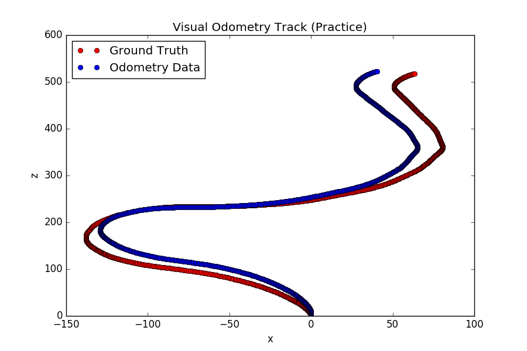

# Visual Odometry
#### *EcEn 631 - Assignment 8 - Luke Newmeyer*

## Task 1 - Practice Sequence

My algorithm uses Harris Corner detection and Lucas-Kanade for point tracking.The results for the VO Practice Sequence are shown below.

## Task 2 - Rotation and Translation Between Frames

In addition to the Harris Corner and Lucas-Kanade Tracking functions used to find visual odometry, this task includes a template matching function. The template matching function is run when the Lucas-Kanade Tracking function cannot find more than 20 ponits. This allows for better performance agains the blank wall affect.

The results of this algorithm can be seen below.

I want to note that I believe the error on the final leg of the track is not an issue in my odometry algorithms. I believe this is a numerical issue. I have spent a significant amount of time investigating this and believe this is an instance of [gimbal lock in the rotation matricies](https://en.wikipedia.org/wiki/Gimbal_lock#Loss_of_a_degree_of_freedom_with_Euler_angles). If I take the same sequence of rotation and translation matricies and plot starting at image 500 of the sequence (meaning I have passed the first turn) I get the following.

This shows that the odometry would be accurate if you started along the back wall. I believe this is proof that the issue is numerical. 
